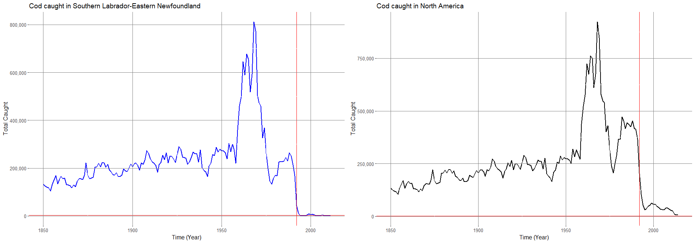
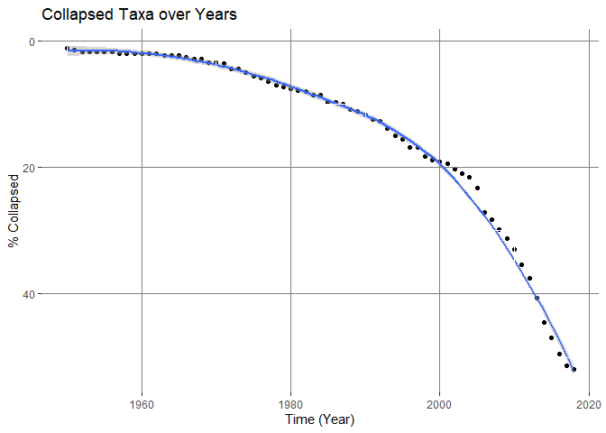

Are the Fisheries Really Collapsed?
================
Alice Hua and Julie Lum

# Assessment 1: Fisheries Collapse Module

This module will focus on understanding and replicating fisheries stock
assessment data and fisheries collapse.

Instead of working with independent dataframes, we are working with a
large relational database which contains many different tables of
different sizes and shapes, but that all relates to eachother through a
series of different ids.

## The Database & Reading in the tables

We used data from the [RAM Legacy Stock Assessment
Database](https://doi.org/10.5281/zenodo.2542918)

We loaded the necessary required libraries. In this assignment, this
includes `ggbubr`, `tidyverse`, `readxl`, and `ramlegacy`.

``` r
knitr::opts_chunk$set(message = FALSE)
library("ggpubr")
library("tidyverse")
library("readxl")
library('ramlegacy')
download_ramlegacy()
ram <- ramlegacy::load_ramlegacy()
names(ram)
```

    ##  [1] "area"                         "assessment"                  
    ##  [3] "assessmethod"                 "assessor"                    
    ##  [5] "biometrics"                   "bioparams"                   
    ##  [7] "bioparams_assessments_views"  "bioparams_ids_views"         
    ##  [9] "bioparams_notes_views"        "bioparams_sources_views"     
    ## [11] "bioparams_units_views"        "bioparams_values_views"      
    ## [13] "management"                   "stock"                       
    ## [15] "taxonomy"                     "timeseries"                  
    ## [17] "timeseries_assessments_views" "timeseries_ids_views"        
    ## [19] "timeseries_notes_views"       "timeseries_sources_views"    
    ## [21] "timeseries_units_views"       "timeseries_values_views"     
    ## [23] "timeseries_years_views"       "tsmetrics"                   
    ## [25] "metadata"                     "most.used.time.series"

# Exercise 1: Investigating the North-Atlantic Cod

In this first portion of the analysis, We sought to replicate the
following figure from the Millenium Ecosystem Assessment Project using
the RAM data.


For data exploration, we joined the following tables because there were
all separated by a common primary id. The combination of tables are the
stock, area, metrics and time series. We noticed that there are multiple
identifiers for each given category, for example, a species can be
identified by both scientific name and common name.

``` r
stock_area_metric <- 
  ram$timeseries %>% 
  left_join(ram$stock) %>% 
  left_join(ram$area) %>% 
  left_join(ram$tsmetrics, by = c("tsid" = "tsunique")) 
head(stock_area_metric)
```

    ##                         assessid stockid
    ## 1 ABARES-BGRDRSE-1960-2011-CHING BGRDRSE
    ## 2 ABARES-BGRDRSE-1960-2011-CHING BGRDRSE
    ## 3 ABARES-BGRDRSE-1960-2011-CHING BGRDRSE
    ## 4 ABARES-BGRDRSE-1960-2011-CHING BGRDRSE
    ## 5 ABARES-BGRDRSE-1960-2011-CHING BGRDRSE
    ## 6 ABARES-BGRDRSE-1960-2011-CHING BGRDRSE
    ##                            stocklong         tsid tsyear tsvalue     tsn
    ## 1 Blue Grenadier Southeast Australia ERbest-ratio   1979 0.00702  623193
    ## 2 Blue Grenadier Southeast Australia ERbest-ratio   1980 0.01290  623193
    ## 3 Blue Grenadier Southeast Australia ERbest-ratio   1981 0.00829  623193
    ## 4 Blue Grenadier Southeast Australia ERbest-ratio   1982 0.01340  623193
    ## 5 Blue Grenadier Southeast Australia ERbest-ratio   1983 0.01450  623193
    ## 6 Blue Grenadier Southeast Australia ERbest-ratio   1984 0.02150  623193
    ##              scientificname     commonname            areaid    region
    ## 1 Macruronus novaezelandiae blue grenadier Australia-AFMA-SE Australia
    ## 2 Macruronus novaezelandiae blue grenadier Australia-AFMA-SE Australia
    ## 3 Macruronus novaezelandiae blue grenadier Australia-AFMA-SE Australia
    ## 4 Macruronus novaezelandiae blue grenadier Australia-AFMA-SE Australia
    ## 5 Macruronus novaezelandiae blue grenadier Australia-AFMA-SE Australia
    ## 6 Macruronus novaezelandiae blue grenadier Australia-AFMA-SE Australia
    ##   inmyersdb myersstockid   country areatype areacode            areaname
    ## 1         0              Australia     AFMA       SE Southeast Australia
    ## 2         0              Australia     AFMA       SE Southeast Australia
    ## 3         0              Australia     AFMA       SE Southeast Australia
    ## 4         0              Australia     AFMA       SE Southeast Australia
    ## 5         0              Australia     AFMA       SE Southeast Australia
    ## 6         0              Australia     AFMA       SE Southeast Australia
    ##   alternateareaname        tscategory tsshort
    ## 1              <NA> FISHING MORTALITY  ERbest
    ## 2              <NA> FISHING MORTALITY  ERbest
    ## 3              <NA> FISHING MORTALITY  ERbest
    ## 4              <NA> FISHING MORTALITY  ERbest
    ## 5              <NA> FISHING MORTALITY  ERbest
    ## 6              <NA> FISHING MORTALITY  ERbest
    ##                                   tslong tsunitsshort tsunitslong
    ## 1 General  exploitation rate time series        ratio       ratio
    ## 2 General  exploitation rate time series        ratio       ratio
    ## 3 General  exploitation rate time series        ratio       ratio
    ## 4 General  exploitation rate time series        ratio       ratio
    ## 5 General  exploitation rate time series        ratio       ratio
    ## 6 General  exploitation rate time series        ratio       ratio

Here we are interested in only looking at Cod in North America from 1850
to 2014. We used the stock information of Total catch accounted for
landings and discards in metric tons. This is to account for all fishes
caught and prevent double counting.

``` r
Cod_NA <- ram$timeseries %>% 
  left_join(ram$stock) %>% 
  left_join(ram$area) %>% 
  left_join(ram$tsmetrics, by = c("tsid" = "tsunique")) %>%
  filter(country == "Canada"| country == "USA", scientificname == "Gadus morhua")%>% 
  filter(tslong == "Total catch (i.e. landings + discards. Add landings + discards to get this).") %>%
  arrange(tsyear)
head(Cod_NA)
```

    ##                            assessid  stockid               stocklong  tsid
    ## 1 DFO-NFLD-COD2J3KL-1850-2011-CHING COD2J3KL Atlantic cod NAFO 2J3KL TC-MT
    ## 2 DFO-NFLD-COD2J3KL-1850-2011-CHING COD2J3KL Atlantic cod NAFO 2J3KL TC-MT
    ## 3 DFO-NFLD-COD2J3KL-1850-2011-CHING COD2J3KL Atlantic cod NAFO 2J3KL TC-MT
    ## 4 DFO-NFLD-COD2J3KL-1850-2011-CHING COD2J3KL Atlantic cod NAFO 2J3KL TC-MT
    ## 5 DFO-NFLD-COD2J3KL-1850-2011-CHING COD2J3KL Atlantic cod NAFO 2J3KL TC-MT
    ## 6 DFO-NFLD-COD2J3KL-1850-2011-CHING COD2J3KL Atlantic cod NAFO 2J3KL TC-MT
    ##   tsyear tsvalue     tsn scientificname   commonname           areaid
    ## 1   1850  133000  164712   Gadus morhua Atlantic cod Canada-DFO-2J3KL
    ## 2   1851  125000  164712   Gadus morhua Atlantic cod Canada-DFO-2J3KL
    ## 3   1852  120000  164712   Gadus morhua Atlantic cod Canada-DFO-2J3KL
    ## 4   1853  117000  164712   Gadus morhua Atlantic cod Canada-DFO-2J3KL
    ## 5   1854  104000  164712   Gadus morhua Atlantic cod Canada-DFO-2J3KL
    ## 6   1855  132000  164712   Gadus morhua Atlantic cod Canada-DFO-2J3KL
    ##              region inmyersdb myersstockid country areatype areacode
    ## 1 Canada East Coast         1     COD2J3KL  Canada      DFO    2J3KL
    ## 2 Canada East Coast         1     COD2J3KL  Canada      DFO    2J3KL
    ## 3 Canada East Coast         1     COD2J3KL  Canada      DFO    2J3KL
    ## 4 Canada East Coast         1     COD2J3KL  Canada      DFO    2J3KL
    ## 5 Canada East Coast         1     COD2J3KL  Canada      DFO    2J3KL
    ## 6 Canada East Coast         1     COD2J3KL  Canada      DFO    2J3KL
    ##                                 areaname alternateareaname
    ## 1 Southern Labrador-Eastern Newfoundland              <NA>
    ## 2 Southern Labrador-Eastern Newfoundland              <NA>
    ## 3 Southern Labrador-Eastern Newfoundland              <NA>
    ## 4 Southern Labrador-Eastern Newfoundland              <NA>
    ## 5 Southern Labrador-Eastern Newfoundland              <NA>
    ## 6 Southern Labrador-Eastern Newfoundland              <NA>
    ##          tscategory tsshort
    ## 1 CATCH or LANDINGS      TC
    ## 2 CATCH or LANDINGS      TC
    ## 3 CATCH or LANDINGS      TC
    ## 4 CATCH or LANDINGS      TC
    ## 5 CATCH or LANDINGS      TC
    ## 6 CATCH or LANDINGS      TC
    ##                                                                         tslong
    ## 1 Total catch (i.e. landings + discards. Add landings + discards to get this).
    ## 2 Total catch (i.e. landings + discards. Add landings + discards to get this).
    ## 3 Total catch (i.e. landings + discards. Add landings + discards to get this).
    ## 4 Total catch (i.e. landings + discards. Add landings + discards to get this).
    ## 5 Total catch (i.e. landings + discards. Add landings + discards to get this).
    ## 6 Total catch (i.e. landings + discards. Add landings + discards to get this).
    ##   tsunitsshort tsunitslong
    ## 1           MT Metric tons
    ## 2           MT Metric tons
    ## 3           MT Metric tons
    ## 4           MT Metric tons
    ## 5           MT Metric tons
    ## 6           MT Metric tons

Here is a grid of graphs of Cod caught between 1850 and 2014 in North
America (USA and Canada) where each graph is displaying the amount of
Cod caught in a specific area name. You can see that the majority of Cod
is caught in Southern Labrador-Eastern Newfoundland. Cod fishing did not
happen in other areas before 1950. To compare our analysis to Worm’s
study, we noticed that their finding indicated that the Cod landing in
ton dropped to 0 in 1992. We made additional graphs below to understand
this discrepancy.

``` r
north_america <- ram$timeseries %>%
  left_join(ram$stock) %>%
  left_join(ram$area) %>% 
  left_join(ram$tsmetrics, by = c("tsid" = "tsunique")) %>%
  filter(country == "Canada"| country == "USA", scientificname == "Gadus morhua")%>% 
  filter(tslong == "Total catch (i.e. landings + discards. Add landings + discards to get this).")%>% 
  group_by(tsyear, areaname) %>% 
  summarize(sum = sum(tsvalue, na.rm = T))
north_america %>%
    ggplot(aes(tsyear, sum, color = areaname)) +
    geom_line(size=1)+
    facet_grid(rows = vars(areaname)) +
    scale_y_continuous(breaks=seq(from=0, to=900000, by = 100000))+
    geom_vline(xintercept = 1992, color = "red") +
    theme(text = element_text(size=12))+
    scale_y_continuous(labels=scales::comma) +
    geom_hline(yintercept = 1992, color = "red") +
    labs(title = "Caught in North Americ", 
       x= "Time (Year)",
       y= "Total caught") +
  theme(
  panel.background = element_rect(fill = NA),
  panel.grid.major = element_line(colour = "grey50"),
  panel.ontop = TRUE
)
```

<!-- -->

Here we have the first graph showing only Cod caught in Southern
Labrador-Eastern Newfoundland and the second is showing Cod caught in
all of North America (adding all Cod from all areas of North America).
We observe that the Newfoundland only Cod more closely resembled Worm’s
finding compared to the Cod caught in all of North America. Though the
Cod landing is not exactly at 0 in 1992 in our Newfoundland graph, we
suspect that there may have been updates to the database since the study
was published or perhaps Worm filtered for a different type of catch
(tslong).

``` r
newfoundland_graph <- north_america %>%
    filter(areaname=="Southern Labrador-Eastern Newfoundland") %>%
    ggplot(aes(tsyear, sum)) +
    geom_line(size=1, color="blue")+
    scale_y_continuous(breaks=seq(from=0, to=900000, by = 100000))+
    geom_vline(xintercept = 1992, color = "red") +
    theme(text = element_text(size=12))+
    scale_y_continuous(labels=scales::comma) +
    geom_hline(yintercept = 1992, color = "red") +
    labs(title = "Cod caught in Southern Labrador-Eastern Newfoundland", 
       x= "Time (Year)",
       y= "Total Caught") +
  theme(
  panel.background = element_rect(fill = NA),
  panel.grid.major = element_line(colour = "grey50"),
  panel.ontop = TRUE
)

northamerica_graph <- north_america %>%
    ungroup() %>%
    group_by(tsyear) %>%
    summarize(sum = sum(sum)) %>%
    ggplot(aes(tsyear, sum)) +
    geom_line(size=1)+
    scale_y_continuous(breaks=seq(from=0, to=900000, by = 100000))+
    geom_vline(xintercept = 1992, color = "red") +
    theme(text = element_text(size=12))+
    scale_y_continuous(labels=scales::comma) +
    geom_hline(yintercept = 1992, color = "red") +
    labs(title = "Cod caught in North America", 
       x= "Time (Year)",
       y= "Total Caught") +
  theme(
  panel.background = element_rect(fill = NA),
  panel.grid.major = element_line(colour = "grey50"),
  panel.ontop = TRUE
)

ggarrange(newfoundland_graph, northamerica_graph) 
```

<!-- -->

-----

# Assessment 2: Temportal Stock Trends

## Stock Collapses

In this portion, we sought to replicate the temporal trend in stock
declines shown in [Worm et
al 2006](http://doi.org/10.1126/science.1132294):


Here we are creating a master global fish table containing all species,
year and collapse status. This status is calculated as defined by Worm’s
study as “defined here as catches dropping below 10% of the recorded
maximum”. There is a column that says False if the specific species has
not collapsed, True if it has.

``` r
fish_bigtable <- ram$timeseries %>% 
  left_join(ram$stock) %>% 
  left_join(ram$area) %>% 
  left_join(ram$tsmetrics, by = c("tsid" = "tsunique")) %>%
  group_by(tsyear, scientificname)%>% 
  summarize(total = sum(tsvalue, na.rm = T))  %>% 
  ungroup() %>% 
  group_by(scientificname) %>% 
  mutate(cumulativemax = cummax(total), 
         collapse = total < .1*cumulativemax) %>%
  select(tsyear, collapse) %>% 
  filter(tsyear > 1949)
head(fish_bigtable)
```

    ## # A tibble: 6 x 3
    ## # Groups:   scientificname [6]
    ##   scientificname      tsyear collapse
    ##   <chr>                <dbl> <lgl>   
    ## 1 Anoplopoma fimbria    1950 FALSE   
    ## 2 Arripis trutta        1950 FALSE   
    ## 3 Atheresthes stomias   1950 FALSE   
    ## 4 Balistes capriscus    1950 FALSE   
    ## 5 Bathyraja parmifera   1950 FALSE   
    ## 6 Brevoortia patronus   1950 FALSE

Not all fish were being caught when the data was first starting to be
collected, and not all fish are caught through the years. To adjust for
this issue, we decide to fill the missing collapse status to False if
the species has not been identified as collapsed, however, if they are
then identified as collapsed, or True, we continued to fill in the
missing status as True. This ensures that a row is present for every
fish for every year. We make the assumption that once a fish species has
collapsed, it’s status will not be revived.

``` r
expanded_fish <- fish_bigtable %>%
  arrange(tsyear) %>%
  expand(scientificname, tsyear=1950:2018) %>% 
  left_join(fish_bigtable, by = c("tsyear", "scientificname")) %>% 
  mutate(collapse = replace(collapse, is.na(collapse), FALSE) ) %>% 
  mutate(collapse = cummax(collapse))
head(expanded_fish)
```

    ## # A tibble: 6 x 3
    ## # Groups:   scientificname [1]
    ##   scientificname   tsyear collapse
    ##   <chr>             <dbl>    <int>
    ## 1 Allocyttus niger   1950        0
    ## 2 Allocyttus niger   1951        0
    ## 3 Allocyttus niger   1952        0
    ## 4 Allocyttus niger   1953        0
    ## 5 Allocyttus niger   1954        0
    ## 6 Allocyttus niger   1955        0

We then counted the total number of collapsed species in each year.

``` r
total_species_collapsed <- expanded_fish %>%
  ungroup() %>% 
  group_by(tsyear) %>% 
  summarize(collapse_year = sum(collapse==T))
head(total_species_collapsed)
```

    ## # A tibble: 6 x 2
    ##   tsyear collapse_year
    ##    <dbl>         <int>
    ## 1   1950             4
    ## 2   1951             5
    ## 3   1952             6
    ## 4   1953             6
    ## 5   1954             6
    ## 6   1955             6

``` r
count_species <- fish_bigtable %>%
  group_by(tsyear) %>% 
  count(scientificname) %>%
  summarize(sum_species = sum(n)) %>% 
  arrange(sum_species)
head(count_species)
```

    ## # A tibble: 6 x 2
    ##   tsyear sum_species
    ##    <dbl>       <int>
    ## 1   2018          24
    ## 2   2017          45
    ## 3   2016          78
    ## 4   1950         113
    ## 5   1951         115
    ## 6   1952         120

Looking at our graph, we have less collapsed taxa percentage than
Boris’s graph. Around 2010, the percent of collapsed Taxa in Boris’s
study was around 80% whereas we notice our value ends a little greater
than 50%. We notice a similar curviture in our analysis and Boris’s
analysis. Both include an increasing rate of change since the data was
collected. We note that Boris’s results are more steep than our own. We
conclude that there may have more data points available since the paper
was published in 2006.

``` r
total_species_collapsed %>% 
  inner_join(count_species) %>% 
  mutate(collapsed_taxa = (collapse_year/362)*100) %>% 
  ggplot(aes(x=tsyear,y=collapsed_taxa)) + 
    geom_point() + geom_smooth() +
    scale_y_reverse()+
  labs(title = "Collapsed Taxa over Years", 
       x= "Time (Year)",
       y= "% Collapsed") +
  theme(
  panel.background = element_rect(fill = NA),
  panel.grid.major = element_line(colour = "grey50"),
  panel.ontop = TRUE
)
```

<!-- -->
